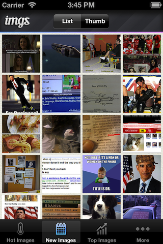

Example Apps
============

Sometimes the best way to familiarize yourself with a new codebase is to see
examples of it being used.  With that in mind, we've put forth our best effort
to make some really great example applications to show off the power of the
platform.  Of course, if you build an open-source app and you'd like it
showcased here, we're happy to include it!

Imgs - Fun Image App
--------------------

Imgs_ is a fun iOS app that showcases the best images on the internet, as
provided by Imgur_, and allows users to comment on them and like them. Imgs_
also uses Parse_ as its storage layer to show how easy integration with modern
platforms can be when using Clutch.

We designed, coded, and shipped this app in a week.

|ImgsScreen1| |ImgsScreen2|

.. _Imgs: https://github.com/boilerplate/imgs
.. _Imgur: http://imgur.com/
.. _Parse: https://parse.com/

.. |ImgsScreen2| image:: _static/screen2.png
    :width: 300px