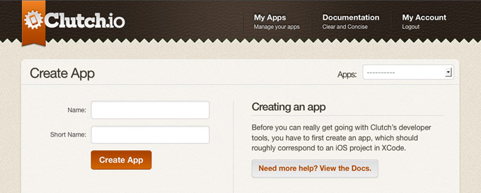
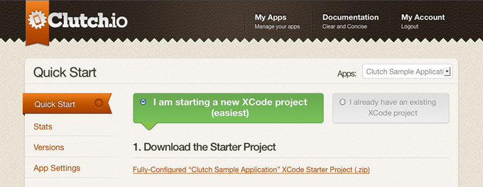

Getting Started
===============

The first thing to do is to `sign up for an account`_ on your local Clutch.io
instance.  If you don't have a Clutch.io instance set up yet, follow the steps
on the `Clutch project README`_.

Now to get started with Clutch, the first thing you need to do is
`create an app`_. All that's required to create an app is to choose an app name
and a short name. The short name will be used in URLs and in certain cases you
might have to type it on the command line.

.. raw:: html
    
      

Once you've created your app, the website will redirect you to the Quick Start
guide for your new app.  The easiest thing to do here is to stay on the
"I am starting a new XCode project" option.  Follow the instructions listed
there and you should be up-and-running with your first Clutch app!

.. _`create an app`: http://127.0.0.1:8000/apps/create/
.. _`sign up for an account`: http://127.0.0.1:8000/register/
.. _`Clutch project README`: https://github.com/clutchio/clutch/blob/master/README.rst